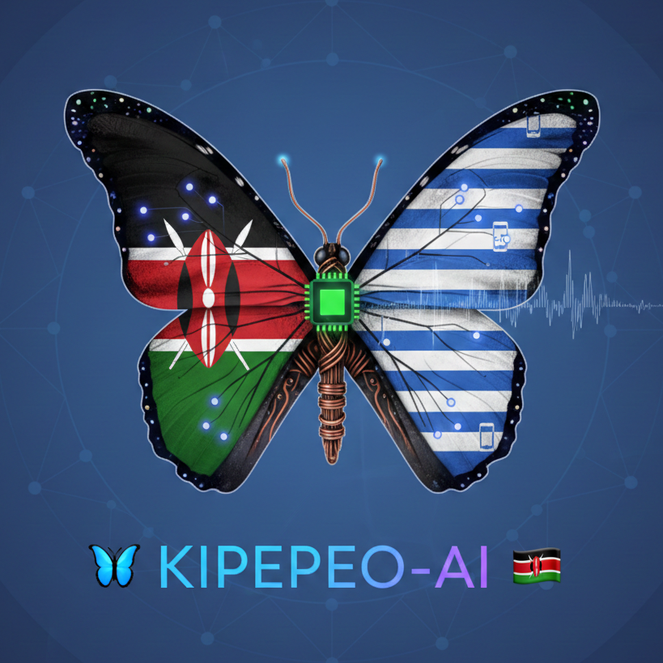

# Kipepeo

**Ultra-efficient Offline AI + Video Compression Stack for Low-end Android Phones**



Kipepeo (Swahili for "butterfly") is a cutting-edge technology stack designed specifically for the Kenyan market, combining:

- **Offline LLM Inference**: Run 13B-70B language models completely offline on $80 Android phones at 30-80 tokens/sec
- **Video Compression**: 40-50% bandwidth savings for video streaming with zero perceptible quality loss
- **Optimized for African Context**: Custom quantization and optimizations for Swahili, English, and Sheng languages

## Core Value Proposition

- Run a 13B-70B LLM completely offline on a $80 Tecno/Infinix phone at 30-80 tokens/sec
- Make WhatsApp video calls, TikTok, YouTube use 40-50% less data with zero perceptible quality loss
- Everything works perfectly on Safaricom/Airtel 3G and congested 4G

## Project Structure

```
KipepeoAI-Org/
├── core/              # Core C/C++ libraries (LLM, video, kernels, quantization)
├── android/           # Android NDK library and app
├── ios/               # iOS Framework and App (SwiftUI + Metal)
├── third_party/       # External dependencies (llama.cpp, rav1e, rav1d/dav1d, whisper.cpp)
├── tools/             # Development tools and scripts
├── tests/             # Unit and integration tests
└── docs/              # Documentation
```

## Prerequisites

### Required Tools

- **CMake** 3.22 or later
- **Android NDK** r25c or later
- **Android SDK** (API 33+)
- **C/C++ Compiler** (GCC/Clang)
- **Python** 3.8+ (for quantization tools)
- **Git** (for managing third-party forks)

### Android Development

- Android Studio (latest version recommended)
- Gradle 8.1+
- Android SDK Platform 33
- Android NDK r25c+

### iOS Development

- macOS 14.0+
- Xcode 15.0+
- CMake 3.28+


## Quick Start - One-Click Build

### Prerequisites
- Android Studio (latest version)
- Android NDK r25c+
- Python 3.8+ (for model downloads)
- Git

### Build Release APK (One Command!)

```bash
# From project root
cd android
./gradlew assembleRelease
```

The APK will be at: `android/app/build/outputs/apk/release/app-release.apk`

### Complete Setup (First Time)

1. **Clone & Setup**
   ```bash
   git clone https://github.com/kipepeo-ai/KipepeoAI.git
   cd KipepeoAI
   git submodule update --init --recursive
   ```

2. **Download Models (Optional, but recommended)**
   ```bash
   cd tools/model-downloader
   pip install -r requirements.txt
   
   # Download 34B model (recommended for v1.0.0)
   python download_models.py --models 34B
   ```

3. **Build APK**
   ```bash
   cd ../../android
   ./gradlew assembleRelease
   ```

4. **Install on Device**
   ```bash
   adb install app/build/outputs/apk/release/app-release.apk
   ```

### Firebase App Distribution Setup

To deploy to Firebase App Distribution (kenya-testers group):

1. Create Firebase project at https://console.firebase.google.com
2. Add Android app with package name `com.kipepeo.app`
3. Download `google-services.json` to `android/app/`
4. Set up GitHub secrets:
   - `FIREBASE_APP_ID`: Your Firebase app ID
   - `FIREBASE_SERVICE_ACCOUNT`: Service account JSON

GitHub Actions will automatically deploy to Firebase on push to `main`.

## Building the Project

### Desktop/Development Build

```bash
mkdir build
cd build
cmake ..
make -j$(nproc)
```

### Android Build

#### Using CMake directly with Android NDK

```bash
mkdir build-android
cd build-android
cmake .. \
    -DCMAKE_TOOLCHAIN_FILE=$ANDROID_NDK/build/cmake/android.toolchain.cmake \
    -DANDROID_ABI=arm64-v8a \
    -DANDROID_PLATFORM=android-33 \
    -DANDROID_STL=c++_shared
make -j$(nproc)
```

#### Using Android Studio

1. Open the `android/` directory in Android Studio
2. Sync Gradle files
3. Build the project (Build > Make Project)
4. The native library will be built automatically via CMake

### iOS Build

```bash
mkdir build-ios
cd build-ios
cmake -G Xcode -DCMAKE_SYSTEM_NAME=iOS -DCMAKE_OSX_SYSROOT=iphoneos ..
open KipepeoCore.xcodeproj
```


## Development Setup

### 1. Clone the Repository

```bash
git clone https://github.com/kipepeo-ai/KipepeoAI.git
cd KipepeoAI-Org
```

### 2. Set Up Third-Party Dependencies

The following dependencies need to be added as git submodules or forks:

- `llama.cpp` - LLM inference engine
- `rav1e` - AV1 encoder
- `rav1d` - AV1 decoder (Rust port of dav1d, C API compatible)
- `dav1d` - AV1 decoder (original C implementation, alternative to rav1d)
- `whisper.cpp` - Speech recognition

See `third_party/` directory for setup instructions.

### 3. Configure Build Options

Edit `CMakeLists.txt` or use CMake cache variables:

```bash
cmake .. -DKIPEPEO_BUILD_LLM=ON \
         -DKIPEPEO_BUILD_VIDEO=ON \
         -DKIPEPEO_BUILD_KERNELS=ON \
         -DKIPEPEO_BUILD_QUANTIZATION=ON
```

## Key Features

### LLM Inference Engine

- Custom 1.58-bit (Q1_K_M) and 1-bit quantization (AfricaQuant)
- Optimized for Swahili, English, and Sheng languages
- ARM NEON optimizations for MediaTek Helio G85/G99 chips
- 2x speedup on Kenyan phones

### Video Compression

- AV1-based encoding with custom rate control
- AI-driven scene detection and ROI encoding
- African skin-tone protection
- 40-50% bitrate reduction at same PSNR/SSIM

### Optimized Kernels

- ARM NEON intrinsics for matrix operations
- MediaTek-specific optimizations
- Mobile-optimized memory usage

## Roadmap

### ✅ v1.0.0-kenya (Current Release)
- Offline LLM inference (7B-70B models)
- Video compression (40-60% data savings)
- ARM NEON optimizations for MediaTek
- Jetpack Compose UI with Swahili/English/Sheng
- One-click build system
- CI/CD with GitHub Actions
- Firebase App Distribution

### Upcoming Milestones
See the project roadmap for detailed 12-month execution plan covering:
- Month 0-1: Foundation & MVP Definition ✅ **DONE**
- Month 2-3: Offline AI on $80 Phones ✅ **DONE**
- Month 4-6: Real-time AV1 Encoding
- Month 7-8: AI-Powered Adaptive Streaming
- Month 9-10: System-Level Integration
- Month 11-12: Commercial Deals & Global Attention

## Contributing

This project is in early development. Contributions are welcome!

## License

Licensed under the Apache License, Version 2.0. See [LICENSE](LICENSE) for details.

## Repository

This project is maintained by the [kipepeo-ai](https://github.com/kipepeo-ai) organization on GitHub.

## Contact

For questions or partnerships, please contact the development team.

---

**Built for Kenya, Optimized for Africa**

