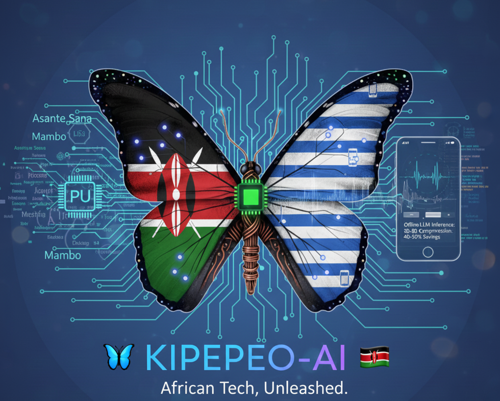

# Kipepeo Architecture

## Overview



Kipepeo is built on a modular architecture with the following core components:

## Core Components

### 1. LLM Inference Engine (`core/llm/`)

- **Purpose**: Offline language model inference
- **Base**: llama.cpp fork with custom modifications
- **Key Features**:
  - Custom quantization (1.58-bit, 1-bit AfricaQuant)
  - ARM NEON optimizations
  - Swahili/English/Sheng support

### 2. Video Compression (`core/video/`)

- **Purpose**: AV1-based video compression with 40-50% bandwidth savings
- **Base**: rav1e fork (rav1e-africa)
- **Key Features**:
  - AI-driven rate control
  - African skin-tone optimization
  - Real-time encoding on mobile

### 3. Optimized Kernels (`core/kernels/`)

- **Purpose**: Low-level optimizations for ARM processors
- **Key Features**:
  - ARM NEON intrinsics
  - MediaTek Helio G85/G99 optimizations
  - 2x speedup on target devices

### 4. Quantization (`core/quantization/`)

- **Purpose**: Custom quantization for African languages
- **Key Features**:
  - 1-bit quantization (AfricaQuant)
  - 1.58-bit quantization (Q1_K_M)
  - Language-specific optimizations

## Android Integration

### NDK Library (`android/libkipepeo/`)

- JNI bridge for Java ↔ C++ interop
- Native interface for LLM and video compression
- Shared library (.so) for Android apps

## Data Flow

```
Android App
    ↓
JNI Bridge (KipepeoNative.java)
    ↓
Native Interface (native_interface.cpp)
    ↓
Core Libraries (LLM, Video, Kernels)
    ↓
Third-Party Libraries (llama.cpp, rav1e, rav1d/dav1d)
```

## Build System

- **CMake**: Cross-platform build system
- **Android NDK**: Native library compilation
- **Gradle**: Android app build

## Performance Targets

- **LLM**: 30-80 tokens/sec on $80 phones
- **Video**: 40-50% bandwidth reduction
- **Memory**: <4GB RAM usage for 7B models

